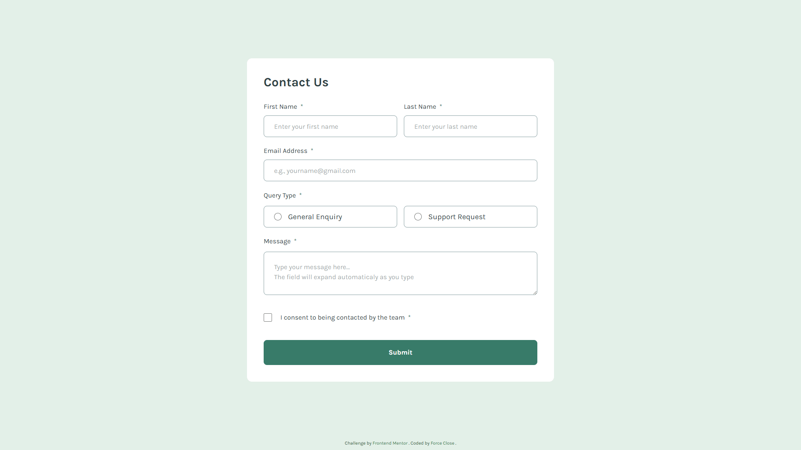

# Frontend Mentor - Contact form solution

This is a solution to the [Contact form challenge on Frontend Mentor](https://www.frontendmentor.io/challenges/contact-form--G-hYlqKJj). Frontend Mentor challenges help you improve your coding skills by building realistic projects.

## Table of contents

- [Overview](#overview)
  - [The challenge](#the-challenge)
  - [Screenshot](#screenshot)
  - [Links](#links)
- [My process](#my-process)
  - [Built with](#built-with)
  - [What I learned](#what-i-learned)
  - [Continued development](#continued-development)
  - [Useful resources](#useful-resources)
  - [AI Collaboration](#ai-collaboration)
- [Author](#author)

---

## Overview

### The challenge

Users should be able to:

- Complete the form and see a success toast message upon successful submission
- Receive form validation messages if:
  - A required field has been missed
  - The email address is not formatted correctly
- Complete the form only using their keyboard
- Have inputs, error messages, and the success message announced on their screen reader
- View the optimal layout for the interface depending on their device's screen size
- See hover and focus states for all interactive elements on the page

**Additional features added to this project:**

- **Live form validation:** Users receive real-time feedback as they type, utilizing the browser's native Constraint Validation API.
- **Dynamic error messages:** Custom error messages are displayed depending on the exact type of validation error (e.g., `valueMissing`, `tooShort`, `patternMismatch`).
- **Auto-focus on error:** The form automatically focuses on the first invalid input upon an unsuccessful submission for better UX and accessibility.
- **Error shake animation:** A subtle shake animation alerts the user when they try to submit an invalid form.
- **Smooth toast animations:** The success toast enters and exits with smooth transitions utilizing modern CSS (`@starting-style`).
- **Custom input states:** Inputs provide clear visual cues for `:valid` and `:user-invalid` states.
- **Reduced motion support:** Animations and transitions are completely disabled for users who prefer reduced motion (`prefers-reduced-motion: reduce`).
- **Modern typography & alignment:** Better text wrapping and precise text alignment utilizing modern CSS (`text-wrap: pretty/balance` and `text-box: trim-both`).

### Screenshot



### Links

- Solution URL: [solution URL](https://github.com/forceclosee/contact-form)
- Live Site URL: [live site URL](https://your-live-site-url.com) <!-- ganti link -->

## My process

### Built with

- Semantic HTML5 markup
- CSS custom properties
- Flexbox
- CSS Grid
- Mobile-first workflow
- [Vite](https://vitejs.dev/) - Frontend Tooling (Build tool & Dev server)
- [Tailwind CSS (v4)](https://tailwindcss.com/) - Utility-first CSS framework
- Vanilla JavaScript (ES6+) - For client-side form validation and DOM manipulation

### What I learned

Through building this project, I reinforced my knowledge of modern frontend development workflows and CSS styling techniques:

- **Setting up Vite**
  I learned how to set up a vanilla JavaScript project using Vite for faster development and optimized builds, along with configuring it to work with modern tools.

```json
// package.json scripts
"scripts": {
  "dev": "vite",
  "build": "vite build",
  "preview": "vite preview"
}
```

- **Styling Radio and Checkbox Inputs with `accent-color`**
  I discovered how easy it is to customize the default appearance of radio buttons and checkboxes to match the project's brand color using the CSS `accent-color` property, eliminating the need for complex custom pseudo-elements.

```html
<!-- Example implementation with Tailwind CSS utility -->
<input type="radio" class="accent-green-600 ..." />
```

If rendered in vanilla CSS, it would look like this:

```css
input[type="radio"],
input[type="checkbox"] {
  accent-color: var(--color-green-600);
}
```

### Continued development

In future projects, I plan to focus on the following areas:

- **Enhanced Accessibility (a11y):** I have started implementing `aria-live` regions for error announcements, but I want to dive deeper into accessibility to ensure that all dynamic states (like the success toast) are perfectly announced to screen reader users in real-time.
- **Backend Integration:** Currently, the form simulates a successful submission on the frontend. I'd like to integrate this with a real backend service (like a serverless function via Netlify or Vercel) or a form-handling API (like Formspree) to actually process and send the data.
- **Advanced Micro-interactions:** While I've implemented basic hover/focus transitions and error shake animations, I want to explore creating fully custom animated radio buttons and checkboxes (instead of relying on the native `accent-color`) to make the form feel even more engaging and polished.

### Useful resources

- [TinyPNG](https://tinypng.com/) - Helped me compress and optimize the images in the project without losing quality, making the page load faster.
- [Cloudinary](https://cloudinary.com/) - Used to host the Open Graph and Twitter card images for social media sharing.
- [Perfect Pixel](https://chrome.google.com/webstore/detail/perfectpixel-by-welldonec/dkaagdgjlophiddqccjgplachon0304v) - Chrome extension that allowed me to overlay the design mockup directly on my live page for pixel-perfect accuracy.
- [MDN Web Docs](https://developer.mozilla.org/en-US/) - Crucial documentation that helped me understand `accent-color`.
- [Fontsource](https://fontsource.org/) - This made self-hosting fonts incredibly easy. I simply installed the font package via npm and imported it directly into my JS file, eliminating the hassle of managing font files manually or relying on external CDNs.

### AI Collaboration

For this project, I used **Gemini CLI**, an interactive AI assistant directly integrated into my terminal. Gemini CLI acted as a highly capable pair programmer throughout the development process.

**How I used it:**

- **Refactoring and Optimization:** I relied on the AI to review my vanilla JavaScript validation logic, making it cleaner and more idiomatic.
- **Git Operations:** The AI generated standard Conventional Commits messages based on the staged changes and prepared the terminal commands, which significantly sped up my workflow.
- **Documentation:** The AI assisted in formatting and populating this `README.md` file, translating comments within my code to English, and filling out SEO, OG, and Twitter Card tags in my `index.html`.
- **Debugging:** While setting up Tailwind CSS (v4) with Vite, Gemini CLI provided rapid solutions for configuration tweaks.

Using Gemini CLI was an incredibly smooth experience. It integrated seamlessly into my workflow without me having to leave the editor or terminal. It not only saved time but also improved the overall code quality and documentation standard of the project.

## Author

- GitHub - [Force Close](https://github.com/forceclosee)
- Frontend Mentor - [@forceclosee](https://www.frontendmentor.io/profile/forceclosee)
- X - [@forceclosee](https://x.com/forceclosee)
